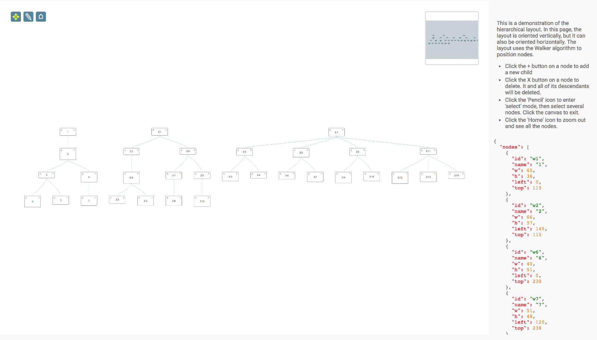
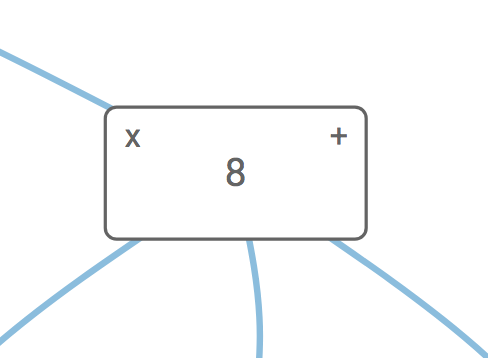

<a id="top"></a>
## Hierarchical Layout - multiple roots

This is an example of how to use the Hierarchical Layout to display a dataset with multiple root Nodes. There are many 
datasets that can be efficiently represented using this layout.



<a name="setup"></a>
### Page Setup

#### CSS

```xml
<link rel="stylesheet" href="node_modules/jsplumbtoolkit/dist/css/jsplumbtoolkit.css">
<link rel="stylesheet" href="node_modules/jsplumbtoolkit-demo-support/dist/css/jsplumbtoolkit-demo-support.css">
<link rel="stylesheet" href="app.css">
```
Font Awesome, `jsplumbtoolkit-demo.css`, and `app.css` are used for this demo and are not jsPlumb Toolkit requirements. `jsplumbtoolkit-defaults.css` is recommended for all apps using the Toolkit, at least when you first start to build your app. This stylesheet contains sane defaults for the various widgets in the Toolkit.

#### JS

- **jsplumbtoolkit.js**
- **app.js** Application specific JS. Discussed on this page.
- **jsplumbtoolkit-demo-support.js** Used to get random datasets for the demo to use.

---

<a name="templates"></a>
### Templates

This demonstration uses a single template to render its nodes:

```xml
<script type="jtk" id="jtk-template-default">
  <div style="width:${w}px;height:${h}px;">
    <div class="name">
      <div class="delete" title="Click to delete">
        <i class="fa fa-times"></i>
      </div>
      <span>${name}</span>
      <div class="add" title="Add child node">
        <i class="fa fa-plus"></i>
      </div>
    </div>
  </div>
</script>
```

Note here that the id of the template is `jtk-template-default`. This demo is a simple demo and does not assign _type_ to any Nodes; subsequently they are considered to have a type of `default`.  This template id conforms to the rules for [inferred template ids](templating#inferring-template-ids), and so the Toolkit knows to use this to render the Nodes in the demo.

[TOP](#top)

---

<a name="init"></a>
### Initialization

We get an instance of the Toolkit and provide a [beforeStartDetach](data-modell#constraining-connectivity) interceptor. Our function does not return `true` and so the user is not able to detach any edges:

```javascript
var toolkit = window.toolkit = jsPlumbToolkit.newInstance({
  beforeStartDetach:function() { return false; }
});
```

Note: we expose `toolkit` on the window because it's useful when explaining things to people to be able to reference some code that is available on the internet. You do not need to do this, of course.

[TOP](#top)

---

<a name="loading"></a>
### Data Loading

Data for the demonstration is created using the `randomHierarchy` function from the included `demo-support.js` file. This function creates an arbitrary hierarchy and assigns different widths/heights to the various nodes. We use this three times and then use a helper function to merge all three hierarchies into one. The end result is a dataset in which there are three Nodes that have only source Edges; these are the roots. 

The data is loaded via this call at the bottom of `app.js`:

```javascript

var hierarchy = jsPlumbToolkitDemoSupport.randomHierarchy(3, 2);
var hierarchy2 = jsPlumbToolkitDemoSupport.randomHierarchy(3, 2);
var hierarchy3 = jsPlumbToolkitDemoSupport.randomHierarchy(2, 4);

function mergeHierarchy(h, h2, prefix) {
    h2.edges.forEach(function(e) {
        e.data.id = prefix + e.data.id;
        e.source = prefix + e.source;
        e.target = prefix + e.target;
        h.edges.push(e);
    });

    h2.nodes.forEach(function(e) {
        e.id = prefix + e.id;
        e.name = prefix + e.name;
        h.nodes.push(e);
    });
}

mergeHierarchy(hierarchy, hierarchy2, "2:");
mergeHierarchy(hierarchy, hierarchy3, "3:");

toolkit.load({
  data:hierarchy,
  onload: renderer.zoomToFit
});
```

The `load` function takes an optional `type` parameter that indicates the format of the data you are loading. If not supplied - as is the case here - it defaults to `"json"`, which refers to the Toolkit's [default Graph JSON syntax](https://docs.jsplumbtoolkit.com/toolkit/current/articles/loading-and-saving-data#graph-json-syntax).

Note also here that we have wired up the `zoomToFit` function from the Surface to the `load` method's `onload` callback.

[TOP](#top)

---

<a name="view"></a>
### View

This demonstration does not specify anything for the View. It consists of a single Node that has the `"default"` type, and the template used to render the node is named in such a way that the Toolkit finds it automatically (as discussed above).

[TOP](#top)

---

<a name="rendering"></a>
### Rendering

This is the call that sets up the UI:

```javascript
toolkit.render(canvasElement, {
  consumeRightClick: false,
  layout: {
    type: "Hierarchical",
    orientation: "horizontal",
          padding: [60, 60]
  },
  miniview: {
    container: miniviewElement,
    initiallyVisible: false
  },
  lassoFilter: ".controls, .controls *, .miniview, .miniview *",
  lassoInvert:true,
  events: {
    canvasClick: function (e) {
      toolkit.clearSelection();
    },
    modeChanged: function (mode) {
      jsPlumb.removeClass(jsPlumb.getSelector("[mode]"), "selected-mode");
      jsPlumb.addClass(jsPlumb.getSelector("[mode='" + mode + "']"), "selected-mode");
    }
  },
  elementsDraggable: false,
  jsPlumb:{
      Anchors: ["Bottom", "Top"],
      Connector: [ "StateMachine", { curviness: 10 } ],
      PaintStyle: { lineWidth: 1, strokeStyle: '#89bcde' },
      HoverPaintStyle: { strokeStyle: "#FF6600", lineWidth: 3 },
      Endpoints: [
          [ "Dot", { radius: 2 } ],
          "Blank"
      ],
      EndpointStyle: { fillStyle: "#89bcde" },
      EndpointHoverStyle: { fillStyle: "#FF6600" }
    }
});
```

Here's an explanation of what the various parameters mean:

- **container**

This identifies the element into which you wish the Toolkit to render.

- **consumeRightClick**

This is something you'll find useful when developing: the default behaviour of the Surface widget is to consume right-clicks.

- **layout**

Parameters for the layout. 

```javascript
layout: {
  type:"Hierarchical",
  orientation:"horizontal",
      padding:[60,60]
}
```

Here we specify a `Hierarchical` layout with orientation `"horizontal"`. `"vertical"` is the other valid value for `orientation`; `"horizontal"` is actually the default and therefore not strictly required. We also set padding of 60 pixels between nodes in each axis.

The Hierarchical layout finds the root Nodes in the dataset by searching for Nodes that have no Edges for which the Node is the target. This is the default behaviour; you can switch off support for multiple root Nodes if you need to, by setting `multipleRoots:false` in the layout params:

```javascript
layout: {
  type:"Hierarchical",
  orientation:"horizontal",
      padding:[60,60],
  multipleRoots:false
}
```

But note that the Toolkit cannot do anything with Nodes that disconnected, so this option could result in an unappealing visual layout. This setting is included for the sake of completeness; it seems unlikely to be commonly used.

As mentioned, the Hierarchical layout searches for Nodes that are not the target of any Edges, by default. It does through providing this default function for `getRootNode`:

```javascript
function(toolkit) {
    if (params.multipleRoots !== false) {
        return toolkit.filter(function(o) {
            return o.objectType === "Node" &&
                o.getTargetEdges().length == 0;
        }).getNodes();
    }
    else {
        return (_super.adapter.getNodeCount() > 0) ? _super.adapter.getNodeAt(0) : null;
    }
}
```

You can in fact provide your own implementation of this, if you need to:

```javascript
layout: {
  type:"Hierarchical",
  orientation:"horizontal",
      padding:[60,60],
  getRootNode:function(toolkit) {
    return TheResultOfSomeComputation();
  }
}
```

- **miniview**

```javascript
{
  container:miniviewElement,
  initiallyVisible:false
}
```

The miniview options specify the element to convert into a miniview, and `initiallyVisible:false` instructs the miniview to remain hidden until some data has been loaded. You can also provide an element ID as the `container` parameter.

- **lassoFilter**

This selector specifies elements on which a mousedown should not cause the selection lasso to begin. In this demonstration we exclude the buttons in the top left and the miniview.

- **lassoInvert**

Tells the Toolkit that the lasso should operate in `inverted` mode, in which unselected parts of the UI are masked.

- **events**

We listen for two events:

  `canvasClick` - a click somewhere on the widget's whitespace. Then we clear the Toolkit's current selection.
  
  `modeChanged` - Surface's mode has changed (either "select" or "pan"). We update the state of the buttons.


- **jsPlumb**

Recall that the Surface widget is backed by an instance of jsPlumb. This parameter sets the [Defaults](/community/doc/defaults.html) for that object.  

[TOP](#top)

---

<a name="selecting"></a>
### Selecting Nodes

Lasso selection is enabled by default on the Surface widget. To activate the lasso, click the pencil icon in the toolbar:


The code that listens to clicks on this icon is as follows:

```javascript
// pan mode/select mode
jsPlumb.on(".controls", "tap", "[mode]", function () {
  renderer.setMode(this.getAttribute("mode"));
});
```

The tap listener extracts the desired mode from the button that was clicked and sets it on the renderer. This causes a `modeChanged` event to be fired, which is picked up by the `modeChanged` event listener in the View.

Note that here we could have used a `click` listener, but `tap` works better for mobile devices. 

##### Lasso Operation

The lasso works in two ways: when you drag from left to right, any node that intersects your lasso will be selected.  When you drag from right to left, only nodes that are enclosed by your lasso will be selected.


##### Exiting Select Mode

The Surface widget automatically exits select mode once the user has selected something. In this application we also listen to clicks on the whitespace in the widget and switch back to pan mode when we detect one. This is the `events` argument to the `render` call:

```javascript
events: {
  canvasClick: function (e) {
    toolkit.clearSelection();
  }
}
```

`clearSelection` clears the current selection and switches back to Pan mode.

[TOP](#top)

---

<a name="adding"></a>
### Adding New Nodes

Each node in this demonstration has two buttons:



Clicking on the **+** button causes a new node to be added as a child of the current Node. Here's the code that sets up the listener and adds the child:

```javascript
jsPlumb.on(canvasElement, "tap", ".add", function (e) {
  // this helper method can retrieve the associated
  // toolkit information from any DOM element.
  var info = toolkit.getObjectInfo(this);
  // get data for a random node.
  var n = jsPlumbToolkitDemoSupport.randomNode();
  // add the node to the toolkit
  var newNode = toolkit.addNode(n);
  // and add an edge for it from the current node.
  toolkit.addEdge({source: info.obj, target: newNode});            
});
```

[TOP](#top)

---

<a name="deleting"></a>
### Deleting Nodes

Clicking the delete button in this demonstration deletes not just the current node, but also all of its descendants.  This is done by creating a [Selection](selections#descendantSelection) and then instructing the Toolkit to remove everything in that Selection:

```javascript
jsPlumb.on(canvasElement, "tap", ".delete ", function (e) {
  var info = toolkit.getObjectInfo(this);
  var selection = toolkit.selectDescendants(info.obj, true);
  toolkit.remove(selection);
});
```

[TOP](#top)
